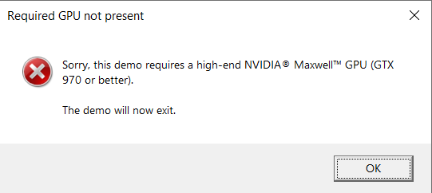
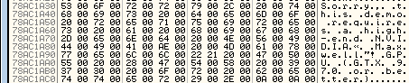
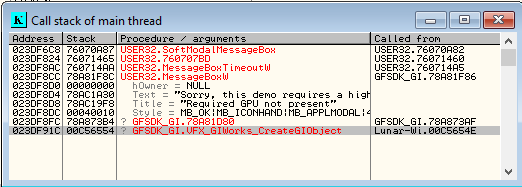
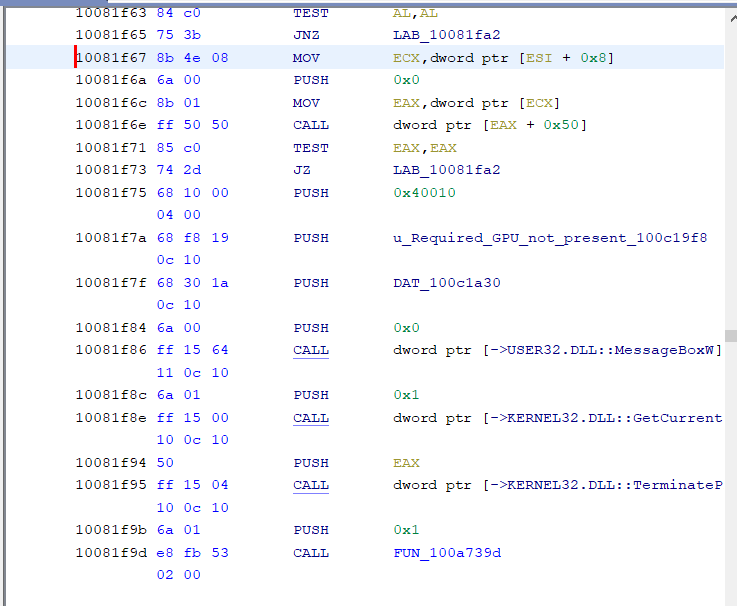

# Nvidia Appolo  11 Landing demo patch

Wanna run Nvidias demo only to find out that your card "isn't supported?"

I have the patch for you!

Is me posting the binaries here illegal? I hope not, I don't have any malice intent by doing this :)

- Install the apollo landing demo if you haven't already
- Go to the install directory
    - Usually `C:\Program Files (x86)\NVIDIA Corporation\NVIDIA Demos\Apollo 11\Engine\Binaries\ThirdParty\GameWorks\GIWorks\Win32\VS2013`
- Rename `GFSDK_GIWorks_x86.dll`
    - `GFSDK_GIWorks_x86.dll.old` works
- Put the patched `GFSDK_GIWorks_x86.dll` in the folder with the old one
- Enjoy!

#### Note: Don't worry about the GFSDK_GIWorksd_x86.dll, they for some reason provided a debug version which isn't used (as far as I can tell)

### How / Why I did it
Apparently an Nvidia Quadro T2000 isn't a good enough gpu, I knew otherwise so I fired up ghidra and ollydbg and started reverse engineering.

I first found the memory location where the error string was located via Ollydbg and set a breakpoint to see what was accessing it.

Once I found the subroutine reading this memory block, I used ollydbgs callstack window.

From here it was apparent what function was creating the messagebox and terminating the program.
(GFSDK_GI.78A81F86)

After doing an instruction pattern search I was able to come across the function in Ghidra, here I would be able to patch said function and bypass the GPU check.

Despite the decompilers C code being messy, It was pretty easy to see what was happening in the assembly code.

It firsts checks to see if `EAX` is zero and if so, show a messagebox and exit.  
The way it checks if `EAX` is zero is by

`TEST EAX,EAX`  
`JNZ LAB_10081fa2`

By simply changing  
`JNZ LAB_...`  (Jump if not zero)  
to  
`JMP LAB_...` (Jump unconditionally)

No matter what it'll completely skip the messagebox and program exit.

Now when launching the program I was crossing my fingers _hoping_ that perhaps my graphics card _was_ missing some special feature, but no. My Quadro T2000 successfully ran the demo.

If you don't trust my binary you can patch it yourself by changing `JNZ` to `JMP` at address `10081f73`

Kinda pointless, maybe I wasted my time but oh well!